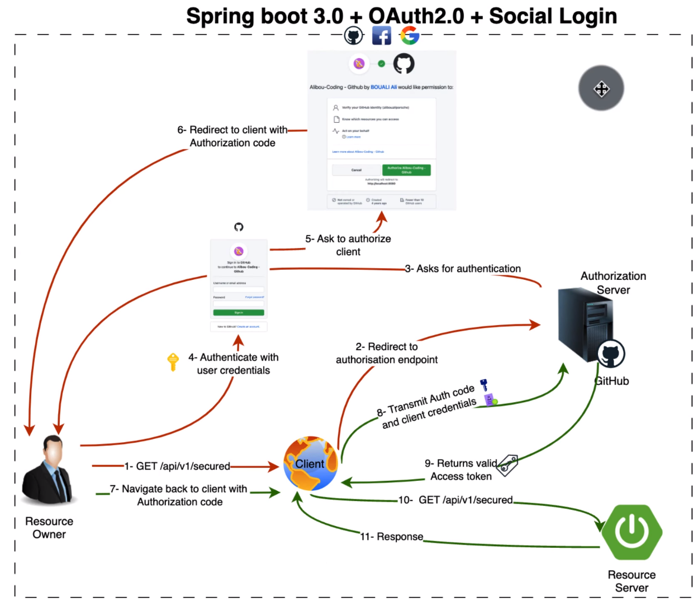
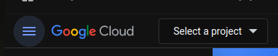
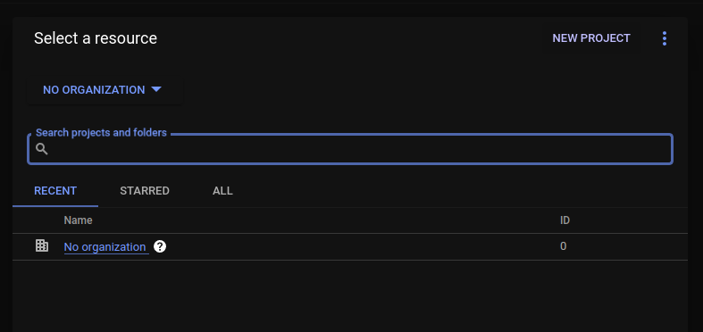
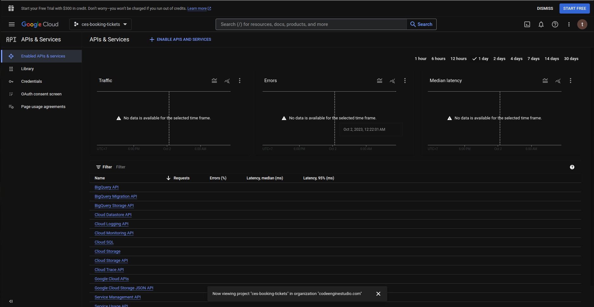
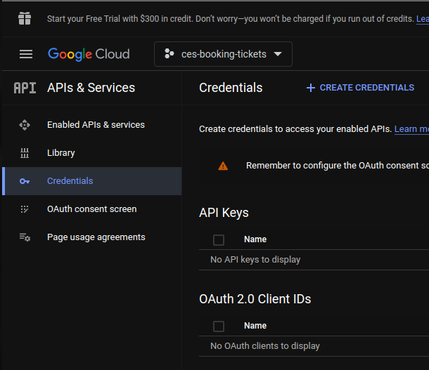
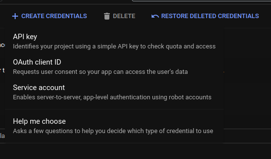
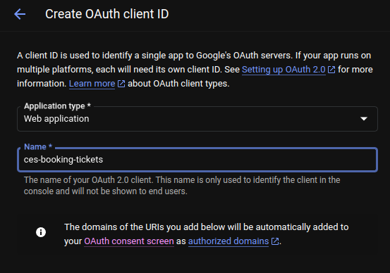
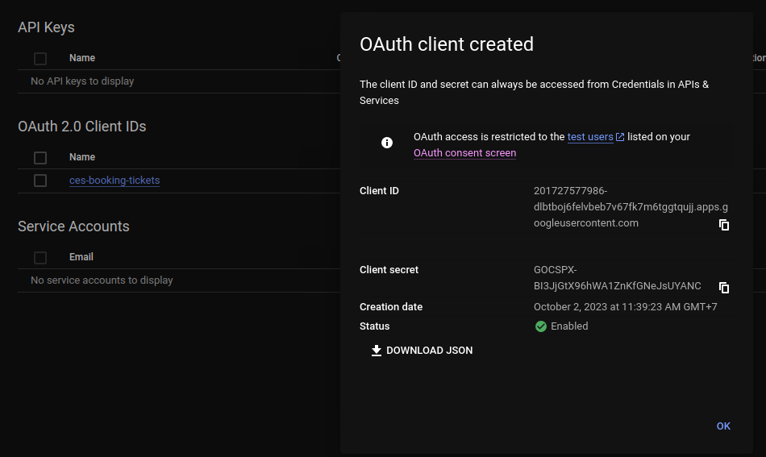
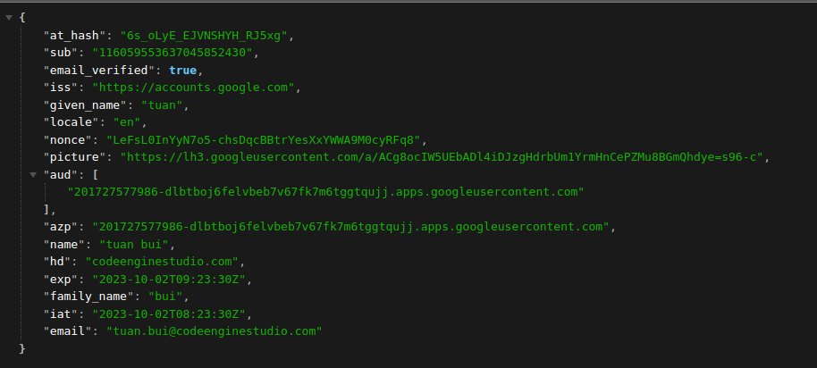

# OAuth2.0 + Social Login

## OAuth2.0 Detail Follow



## Create the simple application login with google

https://console.cloud.google.com/getting-started?supportedpurview=project

### Create the google application

**Step 1: Create new project**

1. Click **Select a project**



2. Click **NEW PROJECT**



3. Result

Set name: **ces-booking-tickets**


**Step 2: Create OAuth client ID**

1. Click **+ CREATE CREDENTIALS**



2. Click **OAuth client ID**



3. Fill **Application type** and **Name**



4. Result with **Client ID** and **Client secret**



### Create Spring Boot project implement OAuth2.0

https://start.spring.io/

**Dependencies**

1. OAuth2 Client

```
    <dependency>
      <groupId>org.springframework.boot</groupId>
      <artifactId>spring-boot-starter-oauth2-client</artifactId>
    </dependency>
```

2. Spring Web

```
    <dependency>
      <groupId>org.springframework.boot</groupId>
      <artifactId>spring-boot-starter-web</artifactId>
    </dependency>
```

**Add clientId and clientSecret to application.properties**

```
spring.security.oauth2.client.registration.google.clientId=201727577986-dlbtboj6felvbeb7v67fk7m6tggtqujj.apps.googleusercontent.com
spring.security.oauth2.client.registration.google.clientSecret=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
```

**Config security**

```
@Configuration
@EnableWebSecurity
public class SecurityConfig {
  @Bean
  public SecurityFilterChain securityFilterChain(HttpSecurity http) throws Exception {
    http
        .csrf()
        .disable()
        .authorizeHttpRequests()
        .anyRequest()
        .authenticated()
        .and()
        .oauth2Login();
    return http.build();
  }
}
```

**Demo Controller**

```
@RestController
@RequestMapping("/")
public class DemoController {
  @GetMapping
  public Object currentUser(OAuth2AuthenticationToken oAuth2AuthenticationToken) {
    return oAuth2AuthenticationToken.getPrincipal().getAttributes();
  }
}
```

**Return current user information**



## Link references

- OAuth2 & Spring boot 3 & Social login | never been easier: https://www.youtube.com/watch?v=2WNjmT2z7c4

- Watch Me Code an OAuth2 Google Login Client with Java Spring:
  https://www.youtube.com/watch?v=ug_89Gx0Ow8

## Questions
- How to implement with reactjs? 
- Where token response from google server?